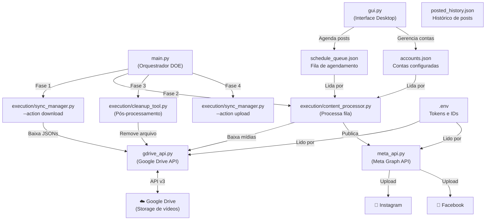

# Guia Técnico: Reels Bot Cloud (ig-fb-reels-bot)

> Versão analisada: Abril/2026 · Linguagem: Python 3.12 · Arquitetura: DOE Framework

---

## Visão Geral

O **Reels Bot Cloud** é uma aplicação desktop (GUI) + backend automatizado para publicação de conteúdo no **Instagram** e **Facebook** via **Meta Graph API**. O sistema gerencia múltiplas contas, agenda postagens com data/hora precisos, baixa mídia do **Google Drive** e realiza upload automaticamente para as plataformas. Suporta três tipos de mídia: **Reels/Vídeo**, **Imagem** e **Carrossel**.

A arquitetura segue o **DOE Framework** (Directive → Orchestration → Execution): a diretiva define o protocolo, o orquestrador (`main.py`) coordena os scripts, e os scripts de execução (`/execution/`) realizam o trabalho determinístico.

---

## Arquitetura



---

## Módulos e Responsabilidades

| Arquivo | Responsabilidade | Funções/Classes Principais |
|---------|------------------|---------------------------|
| `main.py` | Orquestrador DOE: chama os scripts em sequência num loop infinito de 60s | `orchestrate()`, `main()` |
| `gui.py` | Interface gráfica desktop (3611 linhas). Dashboard, agendamento, contas, library | `ReelsBotApp` (classe principal), `QuickScheduleWizard`, `ModernCalendar`, `VideoCard`, `ScheduleCard` |
| `meta_api.py` | Integração com Meta Graph API v25.0. Upload de Reels/Imagem/Carrossel para IG e FB | `MetaAPI`, `upload_ig_reels_resumable()`, `upload_ig_image()`, `upload_ig_carousel()`, `upload_fb_reels_resumable()`, `upload_fb_image()`, `upload_fb_carousel()`, `get_account_details()`, `refresh_token()` |
| `gdrive_api.py` | Integração com Google Drive API v3. Download/upload/delete de arquivos e JSONs de estado | `GoogleDriveAPI`, `download_file()`, `upload_file()`, `save_json()`, `get_json()`, `make_file_public()`, `cleanup_storage()` |
| `config.py` | Carrega variáveis do `.env` via `python-dotenv` e as expõe como constantes globais | `META_ACCESS_TOKEN`, `IG_ACCOUNT_ID`, `FB_PAGE_ID`, `GDRIVE_FOLDER_ID` |
| `execution/content_processor.py` | Lê a fila, baixa mídias do Drive para `.tmp/`, chama MetaAPI para publicar, salva resultados | `process_job()`, `main()` |
| `execution/sync_manager.py` | Sincroniza JSONs de estado entre local e Google Drive (download e upload) | `download_all()`, `upload_all()`, `main()` |
| `execution/cleanup_tool.py` | Lê resultados da execução, atualiza fila+histórico, deleta arquivos do Drive, limpa `.tmp/` | `cleanup_tmp()`, `main()` |
| `execution/test_runner.py` | Executa bateria de testes E2E do sistema completo | Scripts de teste automatizados |
| `directives/scheduler_protocol.md` | Documento de diretiva DOE: define o protocolo operacional (lido por agentes IA) | — |

---

## Dependências Externas

| Biblioteca | Versão | Para que serve |
|------------|--------|----------------|
| `requests` | Latest | Chamadas HTTP para Meta Graph API e tmpfiles.org |
| `google-auth` | Latest | Autenticação com Google APIs (service account) |
| `google-auth-oauthlib` | Latest | OAuth para Google APIs |
| `google-auth-httplib2` | Latest | Transport HTTP para Google APIs |
| `google-api-python-client` | Latest | SDK oficial do Google Drive API v3 |
| `python-dotenv` | Latest | Leitura de variáveis do arquivo `.env` |
| `customtkinter` | Latest | GUI moderna sobre Tkinter (tema escuro, componentes modernos) |
| `Pillow` | Latest | Processamento de imagens na GUI (fotos de perfil das contas) |
| `pytz` | Latest | Timezones (especificamente `America/Sao_Paulo`) |

---

## Tokens e Credenciais Necessários

| Variável | Serviço | Como Obter | Onde Configurar | Validade |
|----------|---------|------------|-----------------|----------|
| `META_ACCESS_TOKEN` | Meta Graph API | [Meta for Developers](https://developers.facebook.com/tools/explorer/) → gerar Page Access Token de longa duração | `.env` e/ou `accounts.json` por conta | ~60 dias (renovável) |
| `IG_ACCOUNT_ID` | Instagram Business | Meta Business Suite → Configurações da conta → ID da conta institucional | `.env` (padrão) e `accounts.json` por conta | Permanente |
| `FB_PAGE_ID` | Facebook Pages | Meta Business Suite → Configurações da página → ID da página | `.env` (padrão) e `accounts.json` por conta | Permanente |
| `GDRIVE_FOLDER_ID` | Google Drive | Drive → Abrir pasta → URL contém o ID após `/folders/` | `.env` e/ou `accounts.json` por conta | Permanente |
| `credentials.json` | Google Service Account | [Google Cloud Console](https://console.cloud.google.com/) → IAM → Service Accounts → Criar chave JSON | Arquivo na raiz do projeto | Permanente |
| `GDRIVE_JSON_B64` | Google Service Account (alternativo) | Base64 do `credentials.json` | `.env` (para ambientes sem arquivo físico) | Permanente |

### Credenciais hardcoded em `meta_api.py` (App Meta)
```python
client_id = "1283566600658374"      # App ID do aplicativo Meta registrado
client_secret = "bf2533e5..."       # App Secret do aplicativo Meta
```
> ⚠️ Estas credenciais identificam o **aplicativo Meta** registrado, não o usuário.

---

## APIs e Integrações Externas

| Serviço | Endpoints Usados | Tipo de Auth | Limites Conhecidos |
|---------|-----------------|--------------|--------------------|
| **Meta Graph API v25.0** | `/{ig_account_id}/media` (criar container), `/{ig_account_id}/media_publish` (publicar), `/{fb_page_id}/video_reels` (Reels FB), `/{fb_page_id}/photos` (Imagem FB), `/{fb_page_id}/feed` (Carrossel FB), `/me/accounts` (listar contas), `/oauth/access_token` (renovar token) | Bearer Token (Page Access Token) | 3 posts/hora (implementado), tokens expiram em ~60 dias |
| **Google Drive API v3** | `files().list()`, `files().get_media()`, `files().create()`, `files().update()`, `files().delete()`, `permissions().create()` | Service Account JSON | Quota diária de downloads, SharedDrives precisam de flags especiais |
| **tmpfiles.org** | `POST https://tmpfiles.org/api/v1/upload` | Sem auth (público) | URL temporária, expira após horas. Usado como fallback para hospedar vídeos publicamente antes de enviar à Meta |

---

## Fluxo de Dados Principal

### Modo Automático (via `main.py` — Loop de 60s)

```
1. main.py → orchestrate()
   │
   ├── 2. sync_manager.py --action download
   │       → Drive: baixa schedule_queue.json, accounts.json, posted_history.json
   │       → Fallback: usa arquivos locais se Drive inacessível
   │
   ├── 3. content_processor.py
   │       → Lê schedule_queue.json + accounts.json
   │       → Para cada job onde schedule_time <= agora:
   │           → Drive: download de vídeo/imagem/zip para .tmp/
   │           → Se CAROUSEL + ZIP: extrai .tmp/carousel_XXXX/
   │           → Para cada conta no job:
   │               → MetaAPI.upload_ig_*() → graph.facebook.com
   │               → MetaAPI.upload_fb_*() → graph.facebook.com
   │               → Vídeo IG: tmpfiles.org → Meta (URL pública necessária)
   │               → Vídeo FB: upload binário direto (resumable)
   │           → Salva resultados em .tmp/last_execution_results.json
   │
   ├── 4. cleanup_tool.py
   │       → Lê .tmp/last_execution_results.json
   │       → Sucesso total → remove da fila, add ao histórico, delete no Drive
   │       → Sucesso parcial → mantém na fila só as contas que falharam
   │       → Falha total → mantém na fila, tenta novamente no próximo ciclo
   │       → Salva schedule_queue.json e posted_history.json
   │       → Limpa .tmp/
   │
   └── 5. sync_manager.py --action upload
           → Envia schedule_queue.json e posted_history.json de volta ao Drive
```

### Modo GUI (via `gui.py`)

```
Usuário abre gui.py
    → Carrega accounts.json, schedule_queue.json, posted_history.json
    → Exibe Dashboard com estatísticas
    → Aba Library: lista vídeos do Google Drive de cada conta
    → Aba Agenda: seleciona vídeos + datas no calendário → QuickScheduleWizard
        → Gera itens na schedule_queue.json com schedule_time (timestamp Unix)
    → Aba Contas: adiciona/edita/remove contas com tokens Meta
    → Botão "Renovar Token": chama MetaAPI.refresh_token()
    → Salva tudo localmente e sincroniza com Drive
```

---

## Arquivos de Configuração

| Arquivo | Formato | Conteúdo | Quando é lido |
|---------|---------|----------|---------------|
| `.env` | KEY=VALUE | `META_ACCESS_TOKEN`, `IG_ACCOUNT_ID`, `FB_PAGE_ID`, `GDRIVE_FOLDER_ID`, `GDRIVE_JSON_B64` | Na importação de `config.py` |
| `config.py` | Python | Expõe variáveis do `.env` como constantes | Por `meta_api.py` e `gdrive_api.py` |
| `accounts.json` | JSON Array | Lista de contas com `name`, `ig_account_id`, `fb_page_id`, `access_token`, `gdrive_folder_id`, `token_expiry`, `ig_username` | Por `content_processor.py` e GUI |
| `schedule_queue.json` | JSON Array | Lista de jobs com `filename`, `gdrive_id`, `media_type`, `caption`, `schedule_time`, `accounts` | Por `content_processor.py` |
| `posted_history.json` | JSON Array | Histórico de posts: `id`, `filename`, `post_time`, `accounts` | Por `cleanup_tool.py` e GUI |
| `settings.json` | JSON Object | `default_caption`, `last_used_accounts`, `ui_theme_color`, `posts_per_day`, `interval_hours` | Pela GUI |
| `credentials.json` | JSON (Google) | Service Account completo com `private_key`, `client_email`, etc. | Por `gdrive_api.py` |
| `library.json` | JSON | Cache local dos arquivos listados do Drive por conta | Pela GUI |

---

## Storage e Persistência

```
LOCAL (disco):
├── .env                          → Credenciais (nunca commitado)
├── credentials.json              → Service account Google (nunca commitado)
├── accounts.json                 → Estado das contas Meta
├── schedule_queue.json           → Fila ativa de agendamentos
├── posted_history.json           → Histórico de publicações
├── settings.json                 → Preferências da GUI
├── library.json                  → Cache da biblioteca de vídeos
└── .tmp/                         → Temporário! Vídeos baixados para publicar
    ├── video.mp4
    └── last_execution_results.json

GOOGLE DRIVE (pasta configurada no GDRIVE_FOLDER_ID):
├── video1.mp4                    → Arquivo de mídia original
├── imagem.jpg
├── carrossel.zip                 → Carrossel como ZIP de imagens
├── schedule_queue.json           → Cópia sincronizada da fila
├── posted_history.json           → Cópia sincronizada do histórico
└── accounts.json                 → Cópia (raramente sincronizada)
```

**Fluxo de estado:** local → Drive (upload) → outro ciclo baixa (download) → mantém consistência entre múltiplas máquinas rodando o bot.

---

## Pontos de Atenção

1. **Token Meta expira em ~60 dias**: O `access_token` em `accounts.json` expira. A GUI tem botão "Renovar Token" que chama `MetaAPI.refresh_token()`. Monitorar `token_expiry` em cada conta.

2. **tmpfiles.org como bridge**: Para Reels do Instagram, a Meta exige URL pública do vídeo — não aceita upload direto. O sistema usa tmpfiles.org (gratuito) como intermediário. Se o serviço estiver fora do ar, tenta o Google Drive como fallback (`make_file_public()`).

3. **Limite de 3 posts/hora**: Implementado no `content_processor.py` (`max_posts_per_hour = 3`). Jobs excedentes aguardam o próximo ciclo.

4. **Falha no Drive = Fallback local**: Se o Google Drive estiver inacessível, o sistema opera com os arquivos locais e tenta sincronizar no próximo ciclo. Log de aviso gerado.

5. **Carrossel via ZIP**: Para agendar um carrossel, compacte as imagens em um único `.zip` e faça upload ao Drive. O `content_processor` extrai automaticamente.

6. **`posted_history.json` não existe inicialmente**: O `cleanup_tool.py` tenta ler este arquivo — deve existir como array vazio `[]` antes do primeiro uso.

7. **Encoding Windows**: O projeto usa `encoding='utf-8'` em todas as operações de arquivo. Em terminais Windows que não suportam UTF-8, pode haver erros com emojis nos logs — use `chcp 65001` ou redirecione a saída.

8. **`GDRIVE_JSON_B64` para ambientes cloud**: Se rodar em servidor sem sistema de arquivos persistente (Heroku, Railway, etc.), codifique o `credentials.json` em base64 e coloque na variável de ambiente `GDRIVE_JSON_B64`.
